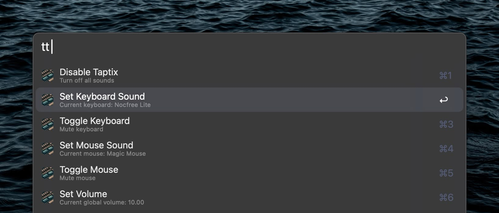
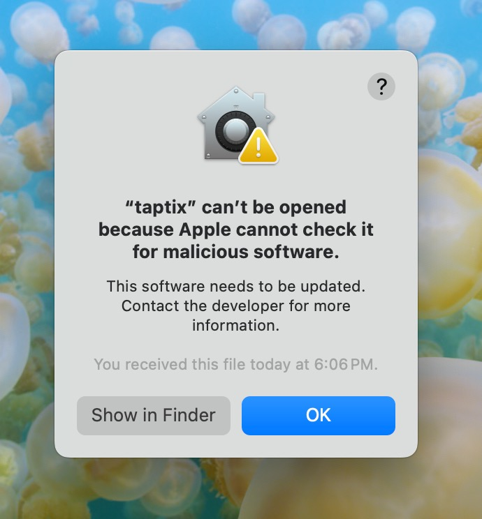
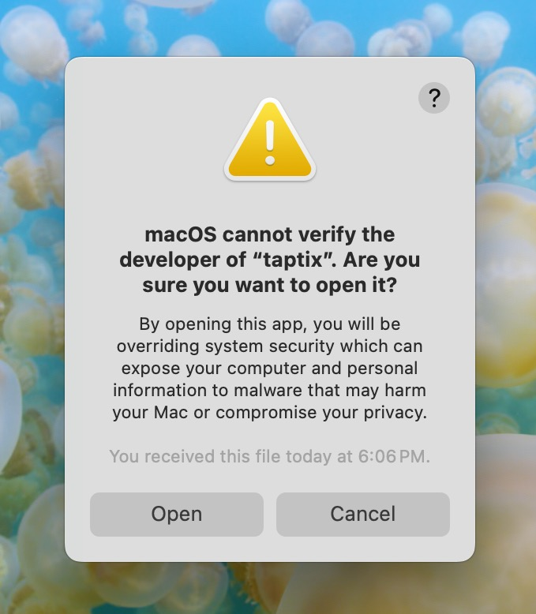

<h1 align="center">TAPTIX</h1>
<p align="center"><strong>Mechanical Keyboard and Mouse Sounds for Alfred</strong></p>
<p align="center">
  <a href="https://youtu.be/_Xd86bBDAco">
    
  </a>
</p>
<p align="center"><em><a href="https://youtu.be/_Xd86bBDAco">~ Video Overview & Setup ~</a></em></p>

## WHAT IS TAPTIX?
Taptix is a lightweight Go app that adds mechanical keyboard and mouse sounds to your system interactions. It integrates with [Alfred](https://www.alfredapp.com/), giving you flexible control and customization options.

---
## FEATURES
* Realistic sound playback for key presses (up and down) and mouse clicks.
* Custom sounds for spacebar and return key.
* Randomized sounds for other keys to enhance realism and simplify custom sound packs.
* Customizable settings:
  * Keyboard and mouse sounds.
  * Global and per-device volume.
  * Mute status per device.
  * Do not disturb mode.
* Easy access to settings via Alfred's search bar, keyboard shortcuts, or external triggers.
* Advanced: Create custom presets by modifying multiple settings at once using external triggers.

---
## INSTALLATION
1. Check the [latest release](https://github.com/ognistik/alfred-taptix/releases/latest) and install the `.alfredworkflow` file.
2. [Authorize Taptix](#authorization) for it to work.

---
## HOW TO USE
### Initial Setup
**The welcome screen configuration settings are used each time Taptix starts.** I suggest you keep the defaults at first and change them later—once you familiarize yourself with how the Workflow works. To access the configuration screen again, right-click the workflow in Alfred's sidebar and select "Configure..."

<p align="center">
  
</p>

### Alfred’s Search Bar
Activate Taptix and modify its settings while running with “taptix” or custom keyword ("tt" by default).
1. Fuzzy search is supported (e.g., "tt sk" for "Set Keyboard Sound").
2. Hold CMD on the option "Activate" or "Deactivate" to quickly open Taptix' configuration.
3. Hold CMD or OPT when selecting "Set Volume" to adjust keyboard or mouse volume separately.

### Hotkeys & External Triggers
Triggers have been color coded for easy setup:
* **Green:** Basic toggles for Taptix activation and main menu.
* **Blue:** By using these hotkeys you can bypass the main menu.
* **Yellow**: These are external triggers that allow total control of Taptix, and they also allow to change multiple settings at once. **[Read more about the possible arguments](#for-automation-ninjas)**.

*Hotkeys and external triggers are optional, providing quick access to your most-used actions.*

---
## CUSTOM SOUNDS
**Want different sounds or to record your own? It's easy!** When you choose a "Custom Path for Sounds" in the workflow setup, Taptix looks for this structure:

```
CustomPath/keyboards/keyboard name/(audio files)
CustomPath/mice/mouse name/(audio files)
```

If `keyboards` and `mice` folders aren't there when Taptix is looking for them (this will also depend on your "Extended Sound Packs" selection), the Workflow creates them with sample sound packs. Just replace the audio files with yours, and add as many keyboard or mouse folders as you like. Audio files must be named exactly like the samples, be mp3s (stereo and close-up recording recommended), and well-trimmed to avoid lag.

**IMPORTANT:**
* **If you don't want custom sounds, leave this configuration field blank.** The Workflow will use default sounds.
* **You need both mouse and keyboard sounds to use Taptix.** If you only want keyboard sounds, you can mute the mous in the configuration.
* **Make sure your keyboard and mouse names in the configuration match your sound pack folders.** Taptix won't start if it can't find them.
* **To use custom sounds plus the included ones, select the Extended Sound Packs Option** Otherwise, Taptix will use either the default sounds or the ones in the custom path (if one is set). It won't look in both locations. This option is meant to give users the flexibility to only use their own sound packs if they prefer.
* **It is possible to use a custom keyboard sound pack together with a default mouse pack or viceversa.** Simply select the Extended Sound Packs Option. For each device sound pack, Taptix will look in its default path first. Only if no packs with the specified name are found within the workflow's directory will it look for sounds in the user's custom path.

---
## CONTRIBUTIONS WELCOME!
Taptix currently has a limited number of sound packs. **If you have high-quality recordings of your mechanical keyboards or mice, feel free to share them with the community!** You can provide me with a zipped download link (or let me know, you may want to upload to the repo directly).

**I'm more interested in good quality, stereo/closely recorded sound packs than having as many sounds as possible.** I'll be happy to include your contributions (and give you credit) if they meet these standards. 

---
## FOR AUTOMATION NINJAS
Taptix has two external triggers (yellow color-coded) which can control the workflow via Alfred's URL scheme or AppleScript. The `mainMenu` external trigger simply opens the main menu. The `cmd` external trigger can receive the following arguments:

| ARGUMENT                 | ACTION                                |
|--------------------------|---------------------------------------|
| `toggle`                 | Activates or deactivates Taptix       |
| `simple_toggle_mouse`    | Mutes/unmutes the mouse               |
| `simple_toggle_keyboard` | Mutes/unmutes the keyboard            |
| `set_mouse`              | Set mouse menu options                |
| `set_keyboard`           | Set keyboard menu options             |
| `set_volume`             | Set global volume with Alfred’s bar   |
| `set_mouse_volume`       | Set mouse volume with Alfred’s bar    |
| `set_keyboard_volume`      | Set keyboard volume with Alfred’s bar |

The `cmd` trigger can also receive any of the following advanced arguments once Taptix is active, and in this way completely bypass the use of Alfred’s bar:

| ADVANCED ARGUMENTS                |
|-----------------------------------|
| `set_keyboard "Keyboard Sound"`   |
| `set_mouse "Mouse Sound"`         |
| `set_volume 4.5`                  |
| `set_keyboard_volume 5`           |
| `set_mouse_volume 5`              |
| `toggle_keyboard`                 |
| `toggle_mouse`                    |
| `mute_keyboard`                   |
| `mute_mouse`                      |
| `unmute_keyboard`                 |
| `unmute_mouse`                    |
| `get_keyboard`                    |
| `get_mouse`                       |
| `get_volume`                      |
| `get_keyboard_volume`             |
| `get_mouse_volume`                |
| `quit`                            |

*Note. The `set_keyboard` and `set_mouse` can optionally receive a second argument with the custom path for their sounds inside double quotes. If no second argument is sent, Taptix will look for the sounds in the same directory of the current keyboard or mouse sounds.*

Furthermore, the `cmd` trigger can receive multiple “Advanced Arguments” comma separated. If you create another workflow specifically for Taptix triggers, or if you want to integrate it with other automation apps, you can use this as a way to trigger custom presets. For example, you can send the following in a single argument: `set_keyboard Nocfree Lite Soft,set_mouse Logitech Master 3S,set_keyboard_volume 9,set_mouse_volume 4`

---
## AUTHORIZATION
**Taptix is a small app. Unfortunately, I'm not a developer nor have a way to notarize it.** When you first run the workflow, you'll see a warning. You can either trust the app or compile it from the source code.

<p align="center">
  
</p>

**To trust the app:**
1. Go to Alfred's Workflows tab.
2. Find Taptix in the sidebar.
3. Right-click and reveal the workflow in Finder.
4. Right-click the "taptix" file and select open.
5. Click "Open" in the warning dialog.

<p align="center">
  
</p>

*NOTE: If you are on Sequoia, you may need [some extra steps](https://mjtsai.com/blog/2024/07/05/sequoia-removes-gatekeeper-contextual-menu-override/)...*

**When you click "Open" a Terminal window will unsuccessfully attempt to initialize Taptix. Don't worry, this only means you've successfully authorized the app.** You can close Terminal and use the Workflow without issues.

If you opt to compile the app yourself you'll need to clone this repo and have Go in your system. Further instructions in [THIS README](https://github.com/ognistik/alfred-taptix/blob/main/Source/README.md). Once done, simply replace the "taptix" file inside the Workflow's folder with the one you've compiled yourself.

**Sorry for this inconvenience!**

---
## FAQ
**Why is there lag?**

Taptix is built in Go, which is actually pretty fast! If you are experiencing an uncomfortable amount of lag, it may be due to using bluetooth with your speakers/headphones. Otherwise, it could also be that the sounds you are using are not well trimmed. If you think this has to do with the Go app itself, feel free to [check it out](https://github.com/ognistik/alfred-taptix/tree/main/Source) and create a pull request if you think it could be optimized.

**I’d like to have a specific audio file play per key instead of randomizing.**

I believe this is possible to customize by modifying the [source code](https://github.com/ognistik/alfred-taptix/tree/main/Source), but the priority for me is that Taptix remains easy and flexible to use. The randomizing feature makes it very simple to create sound packs. If you think of a way to integrate both the randomizing and an optional non-randomizing setting, without making the workflow overly complicated, let me know and we can discuss it. :) 

---
## THANK YOU
Up until now I’ve been using the fantastic [Klack](https://tryklack.com/) app for mechanical keyboard sounds. I still think it is the best in the game. However, it lacks mouse sounds and you cannot create your own sound packs: two things that were important for me. I discovered the open-source project [Type Joy](https://github.com/webdevcody/type-joy)—which was inspired by Klack—and thought it looked simple enough to give this a go. Taptix is a fork of Type Joy and a result of many hours of trying to figure out some bugs, adding features, and customizing it so that it would work well inside Alfred. I would have never been able to do this without the help of Sonnet 3.5. I still know very little of how everything works, and almost nothing about Go, to be honest.

Thank you Klack and thank you Type Joy for the inspiration. And thank you so much guys for trying this out!

*If you find Taptix fun or useful, I would greatly appreciate your support by buying me a coffee at [THIS LINK](https://www.buymeacoffee.com/afadingthought). Your generosity would mean the world to me!*